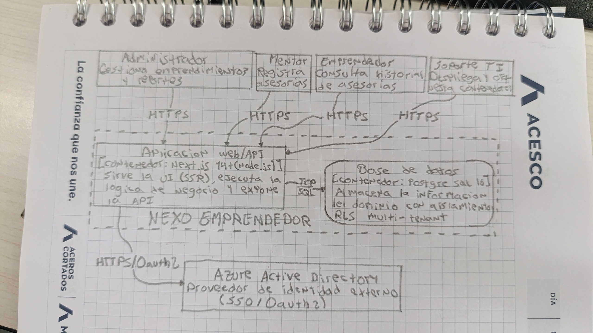
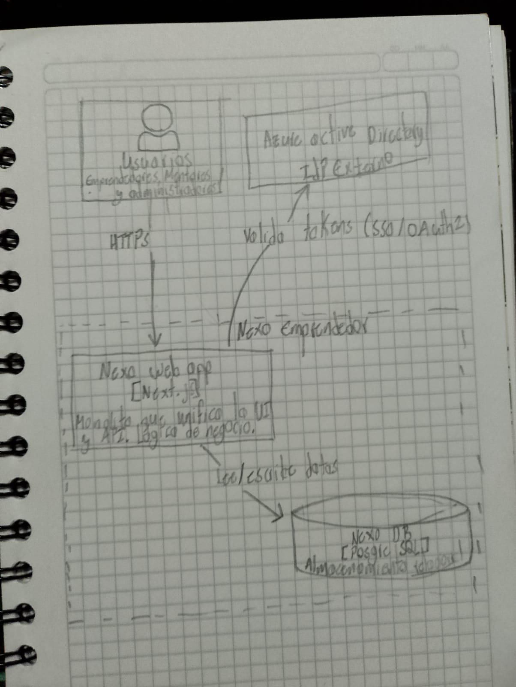
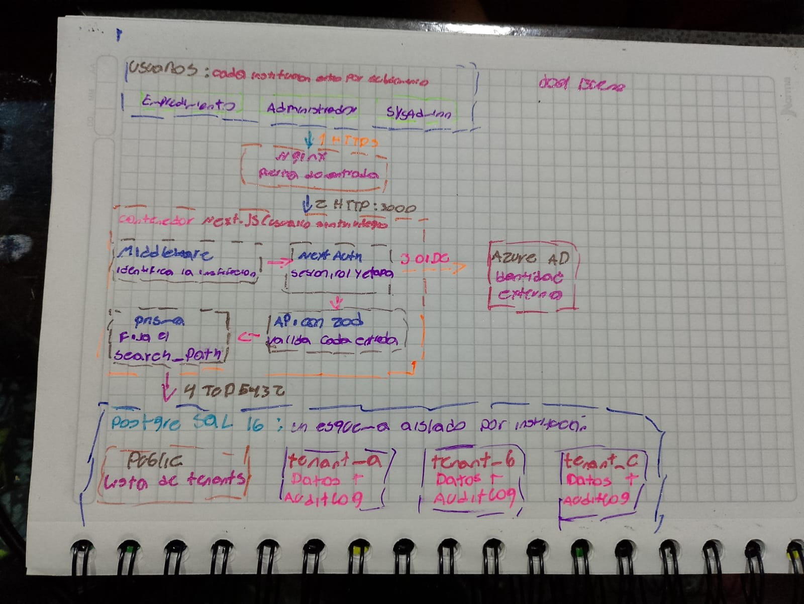
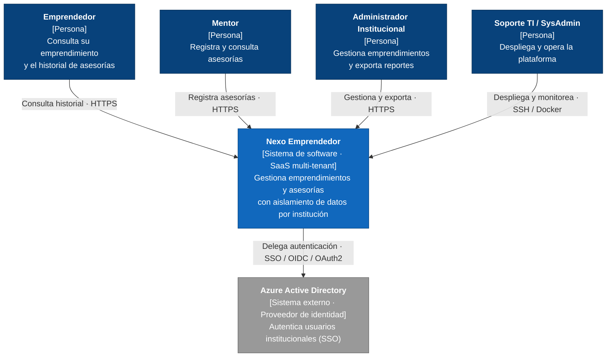
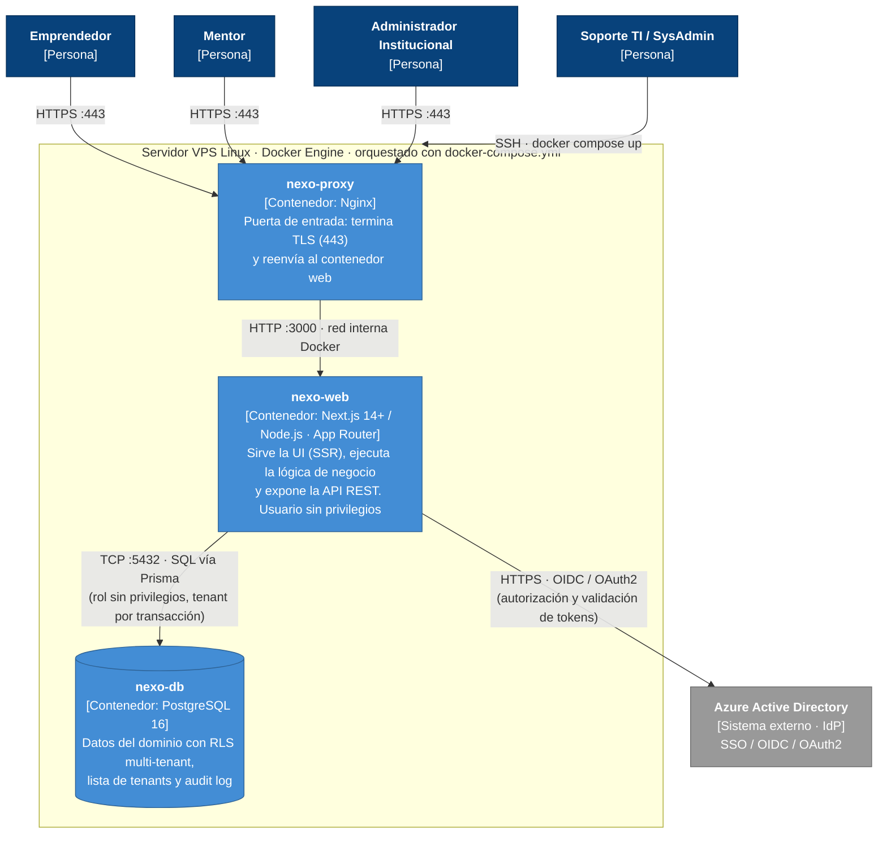
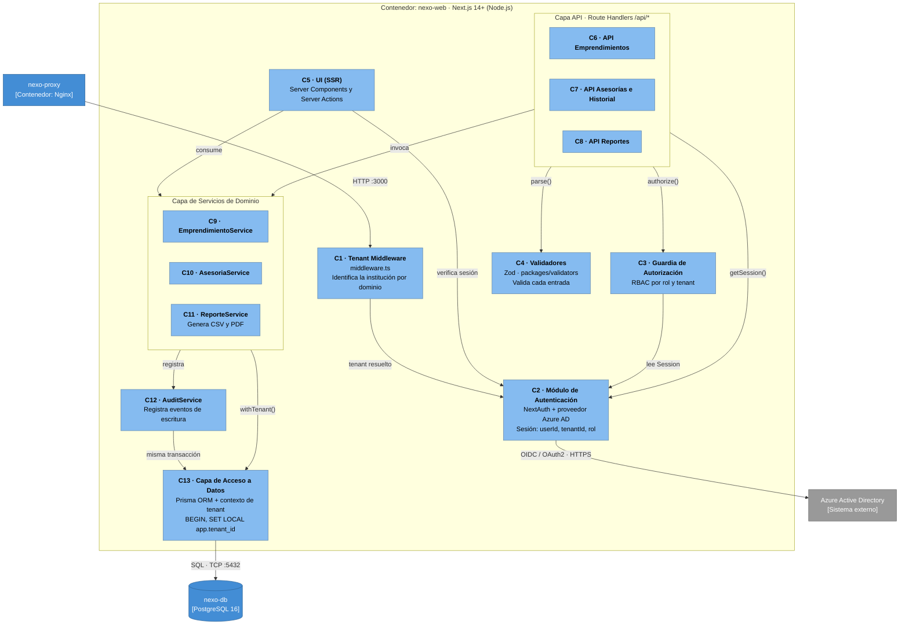

# Informe Técnico de Arquitectura: Modelo C4, Interfaces y Contratos de API

**Proyecto Integrador Nexo Emprendedor**

| | |
|---|---|
| **Integrantes** | Javier Eduardo Gómez Ovalle, Joel Sebastián Bueno Medina y Juan Pablo Angel Quitian |
| **Institución** | Facultad de Ingeniería, Corporación Universitaria Minuto de Dios |
| **Asignatura** | 60-95404 Arquitectura de Software |
| **Docente** | Mg. Juan Camilo Rodríguez Villada |
| **Actividad** | Actividad 2: Representación de la arquitectura con el Modelo C4 |
| **Fecha** | 7 de octubre de 2026 |

---

## Contenido

1. [Anexo individual](#1-anexo-individual)
2. [Diagrama de Contexto (Nivel 1)](#2-diagrama-de-contexto-nivel-1)
3. [Diagrama de Contenedores (Nivel 2)](#3-diagrama-de-contenedores-nivel-2)
4. [Diagrama de Componentes (Nivel 3)](#4-diagrama-de-componentes-nivel-3)
5. [Matriz de Interfaces y Contratos](#5-matriz-de-interfaces-y-contratos)

---

## 1. Anexo individual

Copia de los borradores elaborados durante la clase.

### Borrador 1



### Borrador 2



### Borrador 3



---

## 2. Diagrama de Contexto (Nivel 1)

### 2.1 Límite del sistema

**Dentro del sistema (responsabilidad de Nexo Emprendedor):**
- Gestión de emprendimientos por institución (registro, consulta y actualización).
- Registro y consulta del historial de asesorías entre mentores y emprendedores.
- Exportación de reportes en CSV y PDF.
- Control de acceso por rol y aislamiento de datos entre instituciones (tenants).
- Registro de auditoría de las operaciones de escritura.

**Fuera del sistema:**
- Almacenamiento y verificación de credenciales: se delega a Azure Active Directory.
- Pasarelas de pago, facturación, envío de correos y videollamadas: no hacen parte del alcance actual.
- Administración de la infraestructura del VPS (la realiza el equipo de Soporte TI).

### 2.2 Diagrama



*Figura 1. Diagrama de Contexto (C4 Nivel 1). Fuente: construcción propia.*

### 2.3 Descripción de actores y sistemas externos

| Elemento | Tipo | Descripción | Interacción con Nexo |
|---|---|---|---|
| Emprendedor | Persona | Miembro de una institución que desarrolla un emprendimiento. | Consulta su emprendimiento y el historial de asesorías recibidas. |
| Mentor | Persona | Asesor que acompaña a los emprendedores. | Registra asesorías y consulta las que ha realizado. |
| Administrador Institucional | Persona | Responsable del programa en su institución. | Gestiona emprendimientos y exporta reportes (CSV/PDF). |
| Soporte TI / SysAdmin | Persona | Equipo técnico que opera la plataforma. | Despliega con Docker Compose y monitorea. No accede a los datos de negocio de los tenants a través de la API. |
| Azure Active Directory | Sistema externo | Proveedor de identidad empresarial. | Autentica a los usuarios y emite tokens que Nexo valida. |

---

## 3. Diagrama de Contenedores (Nivel 2)

### 3.1 Diagrama



*Figura 2. Diagrama de Contenedores (C4 Nivel 2). Fuente: construcción propia.*

### 3.2 Contenedores, responsabilidades y tecnologías

| Contenedor | Tecnología | Responsabilidades | Expuesto a |
|---|---|---|---|
| **nexo-proxy** | Nginx | Terminar TLS, reenviar tráfico al contenedor web, ser el único puerto público (443). | Internet |
| **nexo-web** | Next.js 14+ (App Router), Node.js, TypeScript, NextAuth, Zod, Prisma | Renderizar la UI con SSR, resolver el tenant, autenticar y autorizar, validar entradas, ejecutar la lógica de negocio, generar reportes y registrar auditoría. | Solo red interna Docker (puerto 3000) |
| **nexo-db** | PostgreSQL 16 | Persistir los datos con transacciones ACID, aplicar RLS por `tenant_id`, guardar la lista de tenants y el audit log. | Solo red interna Docker (puerto 5432) |
| **Azure AD** (externo) | Microsoft Entra ID | Autenticar usuarios y emitir tokens OIDC. | Internet (HTTPS) |

### 3.3 Relaciones y protocolos

| # | Origen → Destino | Protocolo | Datos / propósito |
|---|---|---|---|
| R1 | Usuarios → nexo-proxy | HTTPS (443) | Navegación web y llamadas a la API. |
| R2 | nexo-proxy → nexo-web | HTTP (3000), red interna | Tráfico reenviado, con cabeceras `X-Forwarded-*` y `Host` para identificar la institución. |
| R3 | nexo-web → nexo-db | TCP 5432, SQL (Prisma) | Lectura y escritura; cada transacción fija `app.tenant_id`. |
| R4 | nexo-web ↔ Azure AD | HTTPS, OIDC / OAuth2 | Flujo Authorization Code, intercambio de código por tokens y validación de firma (JWKS). |
| R5 | Soporte TI → VPS | SSH | Despliegue y operación con `docker compose up`. |

---

## 4. Diagrama de Componentes (Nivel 3)

Se hace zoom-in sobre **nexo-web**, el contenedor crítico, porque concentra la autenticación, el aislamiento multi-tenant, la validación y la lógica de negocio.

### 4.1 Diagrama



*Figura 3. Diagrama de Componentes de nexo-web (C4 Nivel 3). Fuente: construcción propia.*

### 4.2 Responsabilidades y dependencias

| ID | Componente | Responsabilidad | Depende de |
|---|---|---|---|
| C1 | Tenant Middleware | Resolver la institución a partir del dominio de la petición y rechazar dominios no registrados. | Lista de tenants (vía C13) |
| C2 | Módulo de Autenticación | Gestionar el flujo OIDC con Azure AD y construir la sesión `{userId, tenantId, rol}`. Si Azure AD falla, deniega el acceso sin exponer detalles técnicos. | Azure AD, C13 (para mapear usuario y rol) |
| C3 | Guardia de Autorización | Verificar que el rol de la sesión tenga permiso para la acción y que el recurso pertenezca al tenant. | C2 |
| C4 | Validadores (Zod) | Validar y normalizar cada payload, parámetro y filtro; rechazar campos no declarados (`.strict()`), entre ellos `tenantId`. | Tipos compartidos (`packages/shared-types`) |
| C5 | UI (SSR) | Renderizar las vistas en servidor y mostrar los datos según el rol. | C2, C9, C10 |
| C6 | API Emprendimientos | Exponer `/api/emprendimientos`. Orquesta C2, C3, C4 y C9. | C2, C3, C4, C9 |
| C7 | API Asesorías e Historial | Exponer `/api/asesorias`. Orquesta C2, C3, C4 y C10. | C2, C3, C4, C10 |
| C8 | API Reportes | Exponer `/api/reportes/*` y transmitir el archivo generado. | C2, C3, C4, C11 |
| C9 | EmprendimientoService | Reglas de negocio de emprendimientos. | C12, C13 |
| C10 | AsesoriaService | Reglas de negocio de asesorías: el emprendimiento debe existir en el tenant y el mentor debe ser el autenticado. | C12, C13 |
| C11 | ReporteService | Consultar datos y generar CSV/PDF. | C13 |
| C12 | AuditService | Registrar quién, qué y cuándo en `audit_log`, dentro de la misma transacción de la operación. | C13 |
| C13 | Capa de Acceso a Datos | Abrir transacciones con `SET LOCAL app.tenant_id` para que RLS aísle los datos. | PostgreSQL |

---

## 5. Matriz de Interfaces y Contratos

### 5.1 Interfaces entre componentes

| Interfaz | Proveedor | Consumidor(es) | Métodos | Entrada → Salida | Errores |
|---|---|---|---|---|---|
| `ITenantResolver` | C1 Tenant Middleware | C2, C13 | `resolve(host)` | `string` → `TenantRef \| null` | `TenantNotFoundError` |
| `ISessionProvider` | C2 Módulo de Autenticación | C3, C5, C6, C7, C8 | `getSession()` | — → `Session \| null` | `AuthProviderUnavailableError` |
| `IAuthorizationGuard` | C3 Guardia de Autorización | C6, C7, C8 | `authorize(session, permiso)` | `Session \| null`, `Permiso` → `Session` | `UnauthorizedError`, `ForbiddenError` |
| `IValidator<T>` | C4 Validadores | C6, C7, C8 | `parse(payload)` | `unknown` → `T` | `ValidationError` |
| `IEmprendimientoService` | C9 | C5, C6 | `crear`, `listar`, `obtener`, `actualizar` | DTO + `TenantCtx` → `Emprendimiento` / `Page<Emprendimiento>` | `NotFoundError`, `ConflictError` |
| `IAsesoriaService` | C10 | C5, C7 | `registrar`, `listarHistorial`, `obtener` | DTO + `TenantCtx` → `Asesoria` / `Page<Asesoria>` | `NotFoundError`, `ForbiddenError` |
| `IReporteService` | C11 | C8 | `generarReporteAsesorias` | `TenantCtx`, `{formato, desde, hasta}` → `ReporteArchivo` | `ValidationError` |
| `IAuditService` | C12 | C9, C10 | `registrar(tx, evento)` | `TxClient`, `AuditEvent` → `void` | — |
| `ITenantScopedRepository` | C13 | C9, C10, C11, C12, C2 | `withTenant(tenantId, fn)` | `uuid`, `(tx) => Promise<T>` → `T` | `DatabaseError` |
| `IIdentityProvider` (requerida) | Azure AD | C2 | OIDC: `authorize`, `token`, JWKS | Código de autorización → `id_token`, `access_token` | `invalid_grant`, indisponibilidad |
| `ISqlConnection` (requerida) | PostgreSQL 16 | C13 | SQL sobre TCP 5432 | Sentencias parametrizadas → filas | Violación de RLS, conexión caída |

**Definición de las interfaces (TypeScript):**

```ts
export type Rol = 'EMPRENDEDOR' | 'MENTOR' | 'ADMIN_INSTITUCIONAL' | 'SYSADMIN';

export interface Session { userId: string; tenantId: string; rol: Rol; email: string; expiresAt: string; }
export interface TenantCtx { tenantId: string; userId: string; rol: Rol; }
export interface TenantRef { id: string; nombre: string; dominio: string; }
export interface PageReq { page: number; pageSize: number; }            // pageSize máx. 50
export interface Page<T> { items: T[]; page: number; pageSize: number; total: number; }

export interface ITenantResolver {
  resolve(host: string): Promise<TenantRef | null>;
}

export interface ISessionProvider {
  getSession(): Promise<Session | null>;
}

export type Permiso =
  | 'emprendimiento:crear' | 'emprendimiento:leer' | 'emprendimiento:actualizar'
  | 'asesoria:registrar' | 'asesoria:leer' | 'reporte:exportar';

export interface IAuthorizationGuard {
  /** Devuelve la sesión válida o lanza UnauthorizedError (401) / ForbiddenError (403). */
  authorize(session: Session | null, permiso: Permiso): Session;
}

export interface IValidator<T> {
  parse(payload: unknown): T;   // lanza ValidationError con el detalle por campo
}

export interface IEmprendimientoService {
  crear(ctx: TenantCtx, dto: CrearEmprendimientoDto): Promise<Emprendimiento>;
  listar(ctx: TenantCtx, filtro: FiltroEmprendimiento, page: PageReq): Promise<Page<Emprendimiento>>;
  obtener(ctx: TenantCtx, id: string): Promise<Emprendimiento>;
  actualizar(ctx: TenantCtx, id: string, dto: ActualizarEmprendimientoDto): Promise<Emprendimiento>;
}

export interface IAsesoriaService {
  registrar(ctx: TenantCtx, dto: RegistrarAsesoriaDto): Promise<Asesoria>;
  listarHistorial(ctx: TenantCtx, filtro: FiltroAsesoria, page: PageReq): Promise<Page<Asesoria>>;
  obtener(ctx: TenantCtx, id: string): Promise<Asesoria>;
}

export interface IReporteService {
  generarReporteAsesorias(
    ctx: TenantCtx,
    opts: { formato: 'csv' | 'pdf'; desde?: string; hasta?: string }
  ): Promise<{ contentType: string; filename: string; stream: ReadableStream }>;
}

export interface IAuditService {
  registrar(tx: TxClient, evento: {
    tenantId: string; usuarioId: string;
    accion: 'CREAR' | 'ACTUALIZAR' | 'EXPORTAR';
    entidad: 'EMPRENDIMIENTO' | 'ASESORIA' | 'REPORTE'; entidadId?: string;
  }): Promise<void>;
}

export interface ITenantScopedRepository {
  /** Abre una transacción, ejecuta SET LOCAL app.tenant_id y corre fn. Commit o rollback atómico. */
  withTenant<T>(tenantId: string, fn: (tx: TxClient) => Promise<T>): Promise<T>;
}
```

### 5.2 Contratos de API expuestos

**Convenciones generales**
- Base: `https://{dominio-del-tenant}/api`. Formato `application/json; charset=utf-8` (excepto reportes).
- Autenticación: cookie de sesión de NextAuth (`next-auth.session-token`), obtenida tras el SSO con Azure AD.
- El `tenantId` **nunca** viaja en el cuerpo ni en la ruta: se toma de la sesión. Si el payload lo incluye, Zod lo rechaza.
- Fechas en ISO 8601 UTC. Identificadores UUID v4. Paginación con `page` (desde 1) y `pageSize` (por defecto 20, máximo 50).
- Cada respuesta incluye la cabecera `X-Trace-Id` para correlacionar con los logs.

| ID | Método | Ruta | Roles | Respuesta exitosa | Errores posibles |
|---|---|---|---|---|---|
| API-01 | POST | `/api/asesorias` | Mentor | `201 Created` | 400, 401, 403, 404, 500 |
| API-02 | GET | `/api/asesorias` | Emprendedor, Mentor, Admin | `200 OK` (paginado) | 400, 401, 403, 500 |
| API-03 | GET | `/api/asesorias/{id}` | Emprendedor, Mentor, Admin | `200 OK` | 401, 403, 404, 500 |
| API-04 | POST | `/api/emprendimientos` | Admin | `201 Created` | 400, 401, 403, 409, 500 |
| API-05 | GET | `/api/emprendimientos` | Emprendedor, Mentor, Admin | `200 OK` (paginado) | 400, 401, 403, 500 |
| API-06 | GET | `/api/emprendimientos/{id}` | Emprendedor, Mentor, Admin | `200 OK` | 401, 403, 404, 500 |
| API-07 | PATCH | `/api/emprendimientos/{id}` | Admin | `200 OK` | 400, 401, 403, 404, 500 |
| API-08 | GET | `/api/reportes/asesorias` | Admin | `200 OK` (`text/csv` o `application/pdf`) | 400, 401, 403, 500 |
| API-09 | GET | `/api/health` | Público | `200 OK` | 503 |
| EXT-01 | GET/POST | `/api/auth/*` (NextAuth) | Anónimo | Redirección 302 hacia Azure AD y de vuelta | 503 si Azure AD no responde |

#### API-01: Registrar asesoría

`POST /api/asesorias` · Rol: Mentor

**Solicitud**

```json
{
  "emprendimientoId": "5b1f7c0e-6c1d-4b5a-9a43-3f4c1d8f2a10",
  "fecha": "2026-10-08T15:00:00Z",
  "duracionMin": 60,
  "tema": "Validación del modelo de negocio",
  "resumen": "Se revisó la propuesta de valor y se definieron hipótesis a validar con clientes.",
  "compromisos": ["Realizar 10 entrevistas a clientes", "Enviar resultados el viernes"]
}
```

| Campo | Tipo | Regla |
|---|---|---|
| `emprendimientoId` | string (uuid) | Obligatorio; debe existir en el tenant de la sesión. |
| `fecha` | string (date-time) | Obligatorio; ISO 8601. |
| `duracionMin` | integer | Obligatorio; entre 15 y 480. |
| `tema` | string | Obligatorio; 3 a 120 caracteres. |
| `resumen` | string | Obligatorio; 1 a 2000 caracteres. |
| `compromisos` | string[] | Opcional; máximo 10 elementos de hasta 200 caracteres. |

**Respuesta `201 Created`** (cabecera `Location: /api/asesorias/{id}`)

```json
{
  "id": "c0a8b1f2-77d4-4c1e-8c43-9d2f6e7a1b55",
  "emprendimientoId": "5b1f7c0e-6c1d-4b5a-9a43-3f4c1d8f2a10",
  "mentorId": "a6d3e2b1-1f0c-4e55-b7a9-0c4d8e9f1a22",
  "fecha": "2026-10-08T15:00:00Z",
  "duracionMin": 60,
  "tema": "Validación del modelo de negocio",
  "resumen": "Se revisó la propuesta de valor y se definieron hipótesis a validar con clientes.",
  "compromisos": ["Realizar 10 entrevistas a clientes", "Enviar resultados el viernes"],
  "creadoEn": "2026-10-07T20:41:12Z"
}
```

#### API-02: Consultar historial de asesorías

`GET /api/asesorias?emprendimientoId={uuid}&desde={fecha}&hasta={fecha}&page=1&pageSize=20` · Todos los parámetros son opcionales. Objetivo: respuesta en menos de 500 ms para el 95% de las peticiones.

**Respuesta `200 OK`**

```json
{
  "items": [
    {
      "id": "c0a8b1f2-77d4-4c1e-8c43-9d2f6e7a1b55",
      "emprendimientoId": "5b1f7c0e-6c1d-4b5a-9a43-3f4c1d8f2a10",
      "mentorId": "a6d3e2b1-1f0c-4e55-b7a9-0c4d8e9f1a22",
      "fecha": "2026-10-08T15:00:00Z",
      "duracionMin": 60,
      "tema": "Validación del modelo de negocio",
      "resumen": "Se revisó la propuesta de valor y se definieron hipótesis a validar con clientes.",
      "compromisos": ["Realizar 10 entrevistas a clientes"],
      "creadoEn": "2026-10-07T20:41:12Z"
    }
  ],
  "page": 1,
  "pageSize": 20,
  "total": 1
}
```

#### API-04: Crear emprendimiento

`POST /api/emprendimientos` · Rol: Administrador Institucional

**Solicitud**

```json
{
  "nombre": "EcoEmpaques",
  "descripcion": "Empaques biodegradables para pequeños comercios.",
  "sector": "Sostenibilidad",
  "emprendedorId": "e1c2d3b4-5a6f-4d7e-8f90-a1b2c3d4e5f6"
}
```

**Respuesta `201 Created`**

```json
{
  "id": "5b1f7c0e-6c1d-4b5a-9a43-3f4c1d8f2a10",
  "nombre": "EcoEmpaques",
  "descripcion": "Empaques biodegradables para pequeños comercios.",
  "sector": "Sostenibilidad",
  "estado": "ACTIVO",
  "emprendedorId": "e1c2d3b4-5a6f-4d7e-8f90-a1b2c3d4e5f6",
  "creadoEn": "2026-10-07T20:30:00Z"
}
```

Las demás operaciones de emprendimientos (API-05, API-06, API-07) usan este mismo esquema `Emprendimiento`. `PATCH` acepta cualquier subconjunto de `nombre`, `descripcion`, `sector` y `estado` (`ACTIVO`, `PAUSADO`, `CERRADO`).

#### API-08: Exportar reporte de asesorías

`GET /api/reportes/asesorias?formato=csv&desde=2026-09-01&hasta=2026-09-30` · Rol: Administrador Institucional · Objetivo: descarga en menos de 3 s.

| Parámetro | Tipo | Regla |
|---|---|---|
| `formato` | string | Obligatorio: `csv` o `pdf`. |
| `desde`, `hasta` | string (date) | Opcionales; `desde` no puede ser posterior a `hasta`. |

**Respuesta `200 OK`**: `Content-Type: text/csv; charset=utf-8` (o `application/pdf`) y `Content-Disposition: attachment; filename="asesorias_2026-09.csv"`.

```csv
id,emprendimiento,mentor,fecha,duracion_min,tema
c0a8b1f2-77d4-4c1e-8c43-9d2f6e7a1b55,EcoEmpaques,mentor@institucion.edu.co,2026-10-08T15:00:00Z,60,Validación del modelo de negocio
```

La exportación se registra en `audit_log` con la acción `EXPORTAR`.

### 5.3 Esquema de errores

Todas las respuestas de error usan el mismo formato y **nunca incluyen stack traces**.

```json
{
  "error": {
    "code": "VALIDATION_ERROR",
    "message": "La solicitud contiene datos inválidos.",
    "details": [
      { "campo": "duracionMin", "mensaje": "Debe estar entre 15 y 480." }
    ],
    "traceId": "7f3c2b1a-9d4e-4a6b-8c5d-1e2f3a4b5c6d"
  }
}
```

| HTTP | `code` | Cuándo ocurre |
|---|---|---|
| 400 | `VALIDATION_ERROR` | El JSON es inválido, falta un campo, un valor no cumple el esquema Zod o se envía un campo no permitido (por ejemplo `tenantId`). |
| 401 | `UNAUTHENTICATED` | No hay sesión válida o expiró. La UI redirige al IdP en menos de 100 ms. |
| 403 | `FORBIDDEN` | El rol no tiene permiso, o se intenta operar con un tenant distinto al de la sesión (`TENANT_MISMATCH`). Respuesta en menos de 150 ms. |
| 404 | `NOT_FOUND` | El recurso no existe **o pertenece a otro tenant**. RLS lo vuelve invisible, así que no se revela su existencia. |
| 409 | `CONFLICT` | Recurso duplicado (por ejemplo, nombre de emprendimiento repetido en el tenant). |
| 500 | `INTERNAL_ERROR` | Error no controlado. El detalle solo queda en los logs, asociado al `traceId`. |
| 503 | `AUTH_PROVIDER_UNAVAILABLE` | Azure AD no responde. Se deniega el acceso y se registra una alerta. |

### 5.4 Especificación OpenAPI 3.0

```yaml
openapi: 3.0.3
info:
  title: Nexo Emprendedor API
  version: 1.0.0
  description: >
    API REST de la plataforma SaaS multi-tenant Nexo Emprendedor.
    El tenant se determina por el dominio de la petición y la sesión; nunca se envía en el cuerpo.
servers:
  - url: https://{dominio}/api
    variables:
      dominio:
        default: institucion.nexoemprendedor.example
tags:
  - name: Asesorías
  - name: Emprendimientos
  - name: Reportes
  - name: Sistema
security:
  - sesion: []
paths:
  /asesorias:
    post:
      tags: [Asesorías]
      summary: Registrar una asesoría (rol Mentor)
      operationId: registrarAsesoria
      requestBody:
        required: true
        content:
          application/json:
            schema: { $ref: '#/components/schemas/RegistrarAsesoria' }
      responses:
        '201':
          description: Asesoría creada
          headers:
            Location:
              schema: { type: string }
          content:
            application/json:
              schema: { $ref: '#/components/schemas/Asesoria' }
        '400': { $ref: '#/components/responses/ValidationError' }
        '401': { $ref: '#/components/responses/Unauthenticated' }
        '403': { $ref: '#/components/responses/Forbidden' }
        '404': { $ref: '#/components/responses/NotFound' }
        '500': { $ref: '#/components/responses/InternalError' }
    get:
      tags: [Asesorías]
      summary: Consultar historial de asesorías (paginado)
      operationId: listarAsesorias
      parameters:
        - { name: emprendimientoId, in: query, schema: { type: string, format: uuid } }
        - { name: desde, in: query, schema: { type: string, format: date } }
        - { name: hasta, in: query, schema: { type: string, format: date } }
        - { $ref: '#/components/parameters/Page' }
        - { $ref: '#/components/parameters/PageSize' }
      responses:
        '200':
          description: Página de asesorías
          content:
            application/json:
              schema: { $ref: '#/components/schemas/PaginaAsesorias' }
        '400': { $ref: '#/components/responses/ValidationError' }
        '401': { $ref: '#/components/responses/Unauthenticated' }
        '403': { $ref: '#/components/responses/Forbidden' }
        '500': { $ref: '#/components/responses/InternalError' }
  /asesorias/{id}:
    get:
      tags: [Asesorías]
      summary: Obtener una asesoría
      operationId: obtenerAsesoria
      parameters:
        - { $ref: '#/components/parameters/Id' }
      responses:
        '200':
          description: Asesoría
          content:
            application/json:
              schema: { $ref: '#/components/schemas/Asesoria' }
        '401': { $ref: '#/components/responses/Unauthenticated' }
        '403': { $ref: '#/components/responses/Forbidden' }
        '404': { $ref: '#/components/responses/NotFound' }
        '500': { $ref: '#/components/responses/InternalError' }
  /emprendimientos:
    post:
      tags: [Emprendimientos]
      summary: Crear un emprendimiento (rol Administrador Institucional)
      operationId: crearEmprendimiento
      requestBody:
        required: true
        content:
          application/json:
            schema: { $ref: '#/components/schemas/CrearEmprendimiento' }
      responses:
        '201':
          description: Emprendimiento creado
          content:
            application/json:
              schema: { $ref: '#/components/schemas/Emprendimiento' }
        '400': { $ref: '#/components/responses/ValidationError' }
        '401': { $ref: '#/components/responses/Unauthenticated' }
        '403': { $ref: '#/components/responses/Forbidden' }
        '409': { $ref: '#/components/responses/Conflict' }
        '500': { $ref: '#/components/responses/InternalError' }
    get:
      tags: [Emprendimientos]
      summary: Listar emprendimientos (paginado)
      operationId: listarEmprendimientos
      parameters:
        - { name: estado, in: query, schema: { $ref: '#/components/schemas/EstadoEmprendimiento' } }
        - { $ref: '#/components/parameters/Page' }
        - { $ref: '#/components/parameters/PageSize' }
      responses:
        '200':
          description: Página de emprendimientos
          content:
            application/json:
              schema: { $ref: '#/components/schemas/PaginaEmprendimientos' }
        '400': { $ref: '#/components/responses/ValidationError' }
        '401': { $ref: '#/components/responses/Unauthenticated' }
        '403': { $ref: '#/components/responses/Forbidden' }
        '500': { $ref: '#/components/responses/InternalError' }
  /emprendimientos/{id}:
    get:
      tags: [Emprendimientos]
      summary: Obtener un emprendimiento
      operationId: obtenerEmprendimiento
      parameters:
        - { $ref: '#/components/parameters/Id' }
      responses:
        '200':
          description: Emprendimiento
          content:
            application/json:
              schema: { $ref: '#/components/schemas/Emprendimiento' }
        '401': { $ref: '#/components/responses/Unauthenticated' }
        '403': { $ref: '#/components/responses/Forbidden' }
        '404': { $ref: '#/components/responses/NotFound' }
        '500': { $ref: '#/components/responses/InternalError' }
    patch:
      tags: [Emprendimientos]
      summary: Actualizar un emprendimiento (rol Administrador Institucional)
      operationId: actualizarEmprendimiento
      parameters:
        - { $ref: '#/components/parameters/Id' }
      requestBody:
        required: true
        content:
          application/json:
            schema: { $ref: '#/components/schemas/ActualizarEmprendimiento' }
      responses:
        '200':
          description: Emprendimiento actualizado
          content:
            application/json:
              schema: { $ref: '#/components/schemas/Emprendimiento' }
        '400': { $ref: '#/components/responses/ValidationError' }
        '401': { $ref: '#/components/responses/Unauthenticated' }
        '403': { $ref: '#/components/responses/Forbidden' }
        '404': { $ref: '#/components/responses/NotFound' }
        '500': { $ref: '#/components/responses/InternalError' }
  /reportes/asesorias:
    get:
      tags: [Reportes]
      summary: Exportar reporte de asesorías en CSV o PDF (rol Administrador Institucional)
      operationId: exportarReporteAsesorias
      parameters:
        - name: formato
          in: query
          required: true
          schema: { type: string, enum: [csv, pdf] }
        - { name: desde, in: query, schema: { type: string, format: date } }
        - { name: hasta, in: query, schema: { type: string, format: date } }
      responses:
        '200':
          description: Archivo generado
          content:
            text/csv:
              schema: { type: string }
            application/pdf:
              schema: { type: string, format: binary }
        '400': { $ref: '#/components/responses/ValidationError' }
        '401': { $ref: '#/components/responses/Unauthenticated' }
        '403': { $ref: '#/components/responses/Forbidden' }
        '500': { $ref: '#/components/responses/InternalError' }
  /health:
    get:
      tags: [Sistema]
      summary: Estado del servicio
      operationId: health
      security: []
      responses:
        '200':
          description: Servicio operativo
          content:
            application/json:
              schema:
                type: object
                properties:
                  status: { type: string, example: ok }
        '503':
          description: Servicio degradado (por ejemplo, base de datos no disponible)
components:
  securitySchemes:
    sesion:
      type: apiKey
      in: cookie
      name: next-auth.session-token
      description: Sesión de NextAuth emitida tras el SSO con Azure AD.
  parameters:
    Id:
      name: id
      in: path
      required: true
      schema: { type: string, format: uuid }
    Page:
      name: page
      in: query
      schema: { type: integer, minimum: 1, default: 1 }
    PageSize:
      name: pageSize
      in: query
      schema: { type: integer, minimum: 1, maximum: 50, default: 20 }
  schemas:
    EstadoEmprendimiento:
      type: string
      enum: [ACTIVO, PAUSADO, CERRADO]
    RegistrarAsesoria:
      type: object
      additionalProperties: false
      required: [emprendimientoId, fecha, duracionMin, tema, resumen]
      properties:
        emprendimientoId: { type: string, format: uuid }
        fecha: { type: string, format: date-time }
        duracionMin: { type: integer, minimum: 15, maximum: 480 }
        tema: { type: string, minLength: 3, maxLength: 120 }
        resumen: { type: string, minLength: 1, maxLength: 2000 }
        compromisos:
          type: array
          maxItems: 10
          items: { type: string, maxLength: 200 }
    Asesoria:
      type: object
      required: [id, emprendimientoId, mentorId, fecha, duracionMin, tema, resumen, creadoEn]
      properties:
        id: { type: string, format: uuid }
        emprendimientoId: { type: string, format: uuid }
        mentorId: { type: string, format: uuid }
        fecha: { type: string, format: date-time }
        duracionMin: { type: integer }
        tema: { type: string }
        resumen: { type: string }
        compromisos:
          type: array
          items: { type: string }
        creadoEn: { type: string, format: date-time }
    PaginaAsesorias:
      type: object
      required: [items, page, pageSize, total]
      properties:
        items:
          type: array
          items: { $ref: '#/components/schemas/Asesoria' }
        page: { type: integer }
        pageSize: { type: integer }
        total: { type: integer }
    CrearEmprendimiento:
      type: object
      additionalProperties: false
      required: [nombre, emprendedorId]
      properties:
        nombre: { type: string, minLength: 3, maxLength: 120 }
        descripcion: { type: string, maxLength: 2000 }
        sector: { type: string, maxLength: 80 }
        emprendedorId: { type: string, format: uuid }
    ActualizarEmprendimiento:
      type: object
      additionalProperties: false
      minProperties: 1
      properties:
        nombre: { type: string, minLength: 3, maxLength: 120 }
        descripcion: { type: string, maxLength: 2000 }
        sector: { type: string, maxLength: 80 }
        estado: { $ref: '#/components/schemas/EstadoEmprendimiento' }
    Emprendimiento:
      type: object
      required: [id, nombre, estado, emprendedorId, creadoEn]
      properties:
        id: { type: string, format: uuid }
        nombre: { type: string }
        descripcion: { type: string }
        sector: { type: string }
        estado: { $ref: '#/components/schemas/EstadoEmprendimiento' }
        emprendedorId: { type: string, format: uuid }
        creadoEn: { type: string, format: date-time }
    PaginaEmprendimientos:
      type: object
      required: [items, page, pageSize, total]
      properties:
        items:
          type: array
          items: { $ref: '#/components/schemas/Emprendimiento' }
        page: { type: integer }
        pageSize: { type: integer }
        total: { type: integer }
    Error:
      type: object
      required: [error]
      properties:
        error:
          type: object
          required: [code, message, traceId]
          properties:
            code:
              type: string
              enum: [VALIDATION_ERROR, UNAUTHENTICATED, FORBIDDEN, NOT_FOUND, CONFLICT, INTERNAL_ERROR, AUTH_PROVIDER_UNAVAILABLE]
            message: { type: string }
            details:
              type: array
              items:
                type: object
                properties:
                  campo: { type: string }
                  mensaje: { type: string }
            traceId: { type: string, format: uuid }
  responses:
    ValidationError:
      description: Datos inválidos
      content:
        application/json:
          schema: { $ref: '#/components/schemas/Error' }
    Unauthenticated:
      description: Sin sesión válida
      content:
        application/json:
          schema: { $ref: '#/components/schemas/Error' }
    Forbidden:
      description: Rol sin permiso o tenant distinto al de la sesión
      content:
        application/json:
          schema: { $ref: '#/components/schemas/Error' }
    NotFound:
      description: Recurso inexistente o de otro tenant
      content:
        application/json:
          schema: { $ref: '#/components/schemas/Error' }
    Conflict:
      description: Recurso duplicado
      content:
        application/json:
          schema: { $ref: '#/components/schemas/Error' }
    InternalError:
      description: Error interno (sin detalles técnicos)
      content:
        application/json:
          schema: { $ref: '#/components/schemas/Error' }
```
